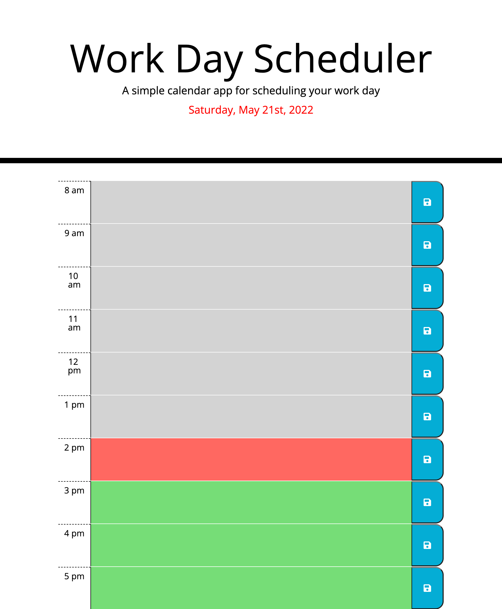

# Work Day Scheduler Starter Code

## Website Purpose

A day planner that's setup for a standard working day by hour

## Page Built With

- HTML 5
- Basic CSS 3
- JavaScript ES6 / ES2015
- jQuery 3.4.1

## Usage

On page load, any saved data is restored. Click in each shaded timeslot to input data. Click any save icon to save all data input into any shaded text area. Data will persist on refresh.

## Website URL

https://anillag.github.io/Challenge-5-Work-Day-Scheduler/

## Contributors

Made with ❤️ by Joe Gallina (contains starter code from Trilogy Education Services)

### ©️2022 Joe Gallina, Trilogy Education Services
